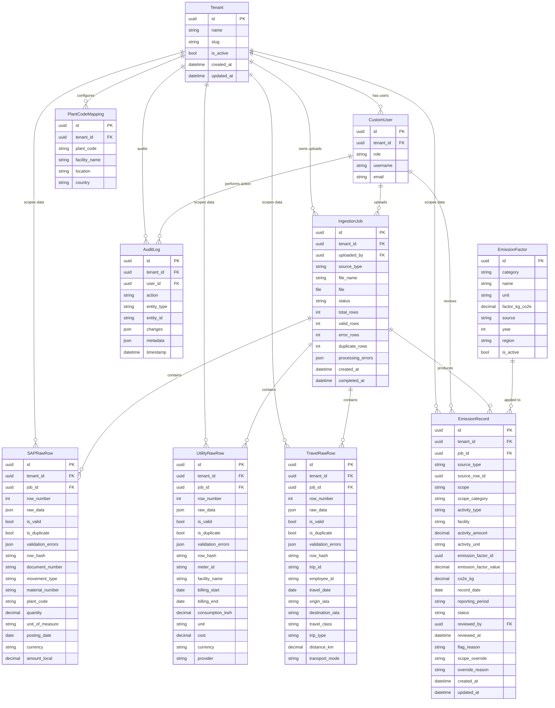

# Data Model Documentation

## Overview

The Breathe ESG data model supports a multi-tenant emissions tracking platform that ingests data from three source systems (SAP fuel procurement, utility billing, corporate travel), normalizes it into a unified emission record format, and provides a review workflow for analyst approval. The model is split across four Django apps:

| App | Purpose |
|:---|:---|
| **core** | Multi-tenancy and user management |
| **ingestion** | CSV upload tracking and source-specific raw row storage |
| **emissions** | Normalized emission records, emission factors, plant code mappings |
| **audit** | Append-only change log for regulatory compliance |

---

## Architecture: Three-Layer Data Pipeline

The model implements a three-layer architecture. Each layer serves a distinct purpose, and the boundaries between them are enforced by the code — not just convention.

```
┌────────────────────────────────────────────────────────────┐
│  Layer 1: Ingestion (Raw)                                  │
│  IngestionJob → SAPRawRow / UtilityRawRow / TravelRawRow   │
│  ─ Preserves original CSV data verbatim in raw_data JSON   │
│  ─ Per-row validation errors                               │
│  ─ SHA-256 duplicate detection                             │
├────────────────────────────────────────────────────────────┤
│  Layer 2: Normalization (Canonical)                         │
│  EmissionRecord                                            │
│  ─ Unified schema across all sources                       │
│  ─ CO₂e computed via EmissionFactor lookup                 │
│  ─ GHG scope classified automatically                      │
│  ─ Review workflow: pending → reviewed → approved → locked │
├────────────────────────────────────────────────────────────┤
│  Layer 3: Audit Trail (Immutable)                          │
│  AuditLog                                                  │
│  ─ Append-only record of every mutation                    │
│  ─ JSON diff of old vs. new values                         │
│  ─ Required for GHG Protocol verification                  │
└────────────────────────────────────────────────────────────┘
```

**Why three layers, not two?** Raw rows must be preserved exactly as received because auditors need to trace any normalized value back to the original source document. If we normalized in place, we'd lose the ability to re-process data when emission factors are updated or when a parsing bug is fixed. The three-layer design means we can always re-derive Layer 2 from Layer 1.

---

## ER Diagram



---

## Model-by-Model Documentation

### core.Tenant

**Purpose:** Represents a customer organisation. Every piece of domain data is scoped to a tenant via foreign key. This is the anchor for multi-tenancy.

| Field | Type | Justification |
|:---|:---|:---|
| `id` | UUID PK | UUIDs prevent ID enumeration across tenants and avoid integer overflow in distributed systems. |
| `name` | CharField(255), unique | Human-readable org name. Unique constraint prevents accidental duplicates during onboarding. |
| `slug` | SlugField(255), unique | URL-safe identifier for API paths (e.g., `/api/tenants/acme-corp/`). Avoids exposing UUIDs in URLs. |
| `is_active` | BooleanField | Soft-delete / suspension mechanism. Deactivating a tenant hides their data without destroying it — important for contractual data-retention requirements. |
| `created_at` / `updated_at` | DateTimeField | Standard audit timestamps. `auto_now_add` and `auto_now` respectively. |

**Design rationale — shared-schema multi-tenancy:** All tenants share the same database tables. Every tenant-scoped query filters by `tenant_id`. This was chosen over schema-per-tenant (PostgreSQL schemas) or database-per-tenant because:

1. **Operational simplicity.** One set of migrations, one connection pool, one backup strategy.
2. **Django compatibility.** `django-tenants` and schema-per-tenant approaches require significant middleware changes and complicate testing.
3. **Scale profile.** For an intern assignment and early-stage SaaS with <100 tenants, shared-schema is sufficient. The indexes on `(tenant_id, ...)` make queries fast.
4. **Trade-off acknowledged.** A noisy-neighbor tenant uploading 100k rows could slow down queries for others. At that scale, you'd add read replicas or move to schema-per-tenant.

---

### core.CustomUser

**Purpose:** Extends Django's `AbstractUser` with UUID primary key, tenant association, and role-based access control.

| Field | Type | Justification |
|:---|:---|:---|
| `id` | UUID PK | Consistent with all other models. Avoids sequential integer PKs leaking user count. |
| `tenant` | FK to Tenant, nullable | `null=True` supports super-admins who operate across tenants. Every other role requires a tenant FK. |
| `role` | CharField with TextChoices | Four roles: `super_admin`, `admin`, `analyst`, `viewer`. Kept simple — no M2M role assignment or Django Groups. For three source types and a review workflow, four roles are sufficient. |

**Role semantics:**
- **super_admin** — Platform operator. Can view all tenants. `tenant` FK is NULL.
- **admin** — Tenant administrator. Can upload files, manage settings, approve records.
- **analyst** — Can review, flag, approve, and override scope classification on emission records.
- **viewer** — Read-only access to dashboards and records.

---

### ingestion.IngestionJob

**Purpose:** Tracks a single CSV file upload from start to finish. Serves as the parent record for all raw rows produced by parsing that file.

| Field | Type | Justification |
|:---|:---|:---|
| `source_type` | CharField with TextChoices | `sap`, `utility`, `travel`. Determines which parser to invoke and which raw-row table to populate. |
| `file` | FileField | Stores the original CSV. Path is `uploads/csv/YYYY/MM/`, partitioned by date to avoid filesystem bottlenecks. |
| `file_name` | CharField(500) | User-visible filename (may differ from the stored path). Useful for UI display and logs. |
| `status` | TextChoices | `pending → processing → completed` or `failed`. State machine for the upload lifecycle. |
| `total_rows` / `valid_rows` / `error_rows` / `duplicate_rows` | PositiveIntegerField | Summary counters for the upload result. Allows the frontend to show a quick summary without counting raw rows. |
| `processing_errors` | JSONField(list) | Captures unhandled exceptions during parsing. Not the same as per-row validation errors — this is for systemic failures like encoding issues or malformed CSVs. |
| `completed_at` | DateTimeField, nullable | NULL until processing finishes. Used to calculate processing duration. |
| `uploaded_by` | FK to CustomUser, SET_NULL | Tracks who uploaded the file. `SET_NULL` because deleting a user should not cascade-delete their upload history. |

**Why a separate job table?** The job is the unit of re-processing. If emission factors change, you re-normalize a job, not individual rows. The job also provides the right granularity for status tracking — "your upload is processing" vs. "your upload completed with 3 errors."

---

### ingestion.RawRowBase (Abstract)

**Purpose:** Abstract base class providing common fields shared by all source-specific raw row tables (`SAPRawRow`, `UtilityRawRow`, `TravelRawRow`).

| Field | Type | Justification |
|:---|:---|:---|
| `raw_data` | JSONField | **The most important field.** Stores the entire original CSV row as a key-value dict. This means we can always inspect what the source system actually sent, even if our parser misinterprets a field. |
| `row_number` | PositiveIntegerField | 1-based index in the CSV. Essential for error messages ("Row 15 has an invalid date") and for correlating back to the source file in the user's spreadsheet. |
| `is_valid` | BooleanField | Quick filter flag. Set to `False` if `validation_errors` is non-empty. Avoids re-evaluating errors on every query. |
| `is_duplicate` | BooleanField | Set to `True` if `row_hash` already exists for the tenant. Duplicates are preserved (not silently dropped) so analysts can see what was rejected and why. |
| `validation_errors` | JSONField(list) | Array of `{type, field, message}` dicts. Structured so the frontend can render field-level error badges in a data grid. Unstructured text errors would require parsing. |
| `row_hash` | CharField(64), indexed | SHA-256 of key fields (varies by source type). Used for cross-upload duplicate detection. Indexed because every new upload checks against existing hashes. |

**Why JSONField for `raw_data`?** CSV columns vary between SAP installations. One customer might export MBLNR, BWART, MATNR; another might include SGTXT and LIFNR. Storing the raw dict means we never lose data, even if our header mapping doesn't recognize a column. PostgreSQL's `jsonb` type also supports indexing and containment queries if we need them later.

**Why JSONField for `validation_errors`?** Errors are heterogeneous — a row might have a missing field, an out-of-range value, AND a date parse failure. A normalized errors table would require a join per row per error type. A JSON array keeps errors co-located with the row, which is the access pattern: "show me row 15 and all its problems."

---

### ingestion.SAPRawRow

**Purpose:** Stores parsed columns from an SAP material-document export (transaction MB51 or a custom ABAP export).

| Field | Source Header | Notes |
|:---|:---|:---|
| `document_number` | MBLNR | SAP Material Document Number. 10-digit alphanumeric. Primary identifier for a goods movement. |
| `movement_type` | BWART | 3-digit SAP movement type code. `101` = goods receipt, `201` = goods issue to cost center, `261` = goods issue to production order, `301` = plant-to-plant transfer, `102` = reversal. We filter for consumption types (201, 261) during normalization. |
| `material_number` | MATNR | SAP material master ID. Format is customer-specific (see SOURCES.md). We use it to identify fuel type: `FUEL-DSL-001` → diesel, `FUEL-GAS-001` → natural gas, `FUEL-LPG-001` → LPG. |
| `plant_code` | WERKS | SAP organizational unit (factory/warehouse). Resolved to a human-readable facility name via `PlantCodeMapping`. |
| `quantity` | MENGE | DecimalField(18,4). Nullable because some SAP rows may export with blank quantities (we've seen this in the sample data). |
| `unit_of_measure` | MEINS | SAP unit code: `L` (liters), `KG`, `GAL`, `M3`. The normalizer handles unit conversion downstream. |
| `posting_date` | BUDAT | From MKPF header table. Can arrive as `DD.MM.YYYY` (German locale) or `YYYYMMDD` (SAP internal format). Both are handled by `date_utils.parse_date()`. |
| `currency` | WAERS | ISO currency code (EUR, USD). Stored for reference but not used in emission calculations. |
| `amount_local` | DMBTR | From MSEG item table. Amount in local currency. Useful for cost tracking but not directly used for CO₂e. |

**Duplicate detection hash:** `SHA-256(tenant_id | document_number | material_number | plant_code | quantity | posting_date)`. This catches re-uploads of the same SAP export. It will NOT catch a genuinely duplicated transaction in SAP itself (e.g., the double-posted row 14/15 in our sample data with identical MBLNR values but different document numbers) — that requires business-logic review, which is why the analyst review workflow exists.

---

### ingestion.UtilityRawRow

**Purpose:** Stores parsed columns from a utility billing or meter-reading CSV.

| Field | Justification |
|:---|:---|
| `meter_id` | Unique identifier for the physical meter. Facilities often have multiple meters (main power vs. HVAC, or separate meters per floor). |
| `facility_name` | Human-readable facility name. Denormalized here because utility CSVs include it, and it avoids a join during rendering. |
| `billing_start` / `billing_end` | DateFields. Utility billing periods rarely align with calendar months (e.g., Jan 15 – Feb 14). Both dates are stored so we can correctly attribute consumption to reporting periods. |
| `consumption_kwh` | DecimalField(18,4). Primary activity data for emission calculations. |
| `unit` | Defaults to `kWh`. Included for future support of gas meters (therms), water (gallons), etc. |
| `cost` / `currency` | For cost tracking. Not used in CO₂e calculations but useful for energy audits. |
| `provider` | Utility company name. Could be relevant for market-based Scope 2 factors. |

**Duplicate detection hash:** `SHA-256(tenant_id | meter_id | billing_start | billing_end | consumption)`. Catches exact re-uploads. Overlapping billing periods (like the deliberate overlap in our sample data) require validator logic, not just hash comparison.

---

### ingestion.TravelRawRow

**Purpose:** Stores parsed columns from a corporate travel expense CSV (e.g., Concur export).

| Field | Justification |
|:---|:---|
| `trip_id` | Maps to the expense report ID. Used for grouping related segments (outbound flight + hotel + return flight). |
| `employee_id` | For attribution and cost-center allocation. Stored but not used in emission calculations — emissions are activity-based, not person-based. |
| `travel_date` | The departure date. Used as `record_date` in the normalized EmissionRecord. |
| `origin_iata` / `destination_iata` | 3-character IATA airport codes. Used for great-circle distance calculation when `distance_km` is not provided in the source data. |
| `travel_class` | Economy, Business, Premium_Economy, First. Determines which DEFRA emission factor to apply (business class ≈ 3× economy per passenger-km). |
| `trip_type` | `one_way` or `round_trip`. If `round_trip`, the parser doubles the computed distance. |
| `distance_km` | DecimalField(12,2). If provided in the CSV, used directly. If missing, computed via haversine formula from IATA codes. Help text documents this fallback behavior. |
| `transport_mode` | `air`, `rail`, `road`. Determines which category of emission factor to look up. |

**Distance computation:** The parser uses a haversine great-circle calculation from IATA coordinates in `iata_airports.json`. This is an approximation — actual flight paths are longer due to airways routing, ATC restrictions, and wind patterns. DEFRA methodology accepts great-circle distance + 9% uplift for short-haul and 7% for long-haul, but we use raw great-circle for simplicity and document the approximation.

---

### emissions.EmissionFactor

**Purpose:** Lookup table of kg CO₂e per unit for each activity type. Pre-seeded from EPA and DEFRA data (see `sample_data/emission_factors.json`).

| Field | Justification |
|:---|:---|
| `category` | TextChoices: `fuel`, `electricity`, `travel_air`, `travel_rail`, `travel_road`. Determines which normalizer path uses this factor. |
| `name` | Human-readable name (e.g., "Diesel", "US Grid Average", "Air Economy Long-Haul"). Used for display and as a secondary lookup key. |
| `unit` | The input unit this factor applies to (e.g., `L`, `kWh`, `km`). Must match the `activity_unit` on EmissionRecord. |
| `factor_kg_co2e` | DecimalField(12,6). The actual conversion factor. Six decimal places because some factors (like rail per km) are quite small. |
| `source` | "EPA", "DEFRA", or "custom". For auditability — an external verifier needs to know which reference dataset was used. |
| `year` | Reference year. Emission factors change annually (e.g., DEFRA updates grid factors each year). Storing the year allows historical re-calculation. |
| `region` | Geographic applicability. Electricity factors vary by eGRID subregion (ERCT for Texas, NWPP for Pacific Northwest). Fuel factors are typically global. |
| `is_active` | Boolean. When a new year's factors are loaded, old factors are deactivated rather than deleted — preserving the ability to re-verify historical calculations. |

**Unique constraint:** `(category, name, unit, year, region)`. Prevents loading the same factor twice. Allows multiple factors for the same fuel in different regions or years.

---

### emissions.PlantCodeMapping

**Purpose:** Resolves SAP WERKS plant codes (e.g., `1000`, `2000`, `3000`) to human-readable facility names and locations. This is tenant-specific because different customers have different SAP configurations.

| Field | Justification |
|:---|:---|
| `plant_code` | The SAP WERKS value. CharField, not IntegerField, because some SAP installations use alphanumeric plant codes. |
| `facility_name` | What the analyst sees in the dashboard: "Munich Manufacturing Plant" instead of "1000". |
| `location` | Free-text location string. Used for geographic grouping in dashboards. |
| `country` | Relevant for country-specific emission factors (e.g., different grid electricity factors). |

**Unique constraint:** `(tenant, plant_code)`. A plant code means different things for different tenants.

---

### emissions.EmissionRecord

**Purpose:** The unified, normalized emission record. This is the single model that the review dashboard operates on — regardless of whether the data came from SAP, utility bills, or travel reports.

This is the most important model in the system. It collapses three heterogeneous source formats into one canonical schema.

| Field | Justification |
|:---|:---|
| `source_type` | `sap` / `utility` / `travel`. Enables filtering by data source in the dashboard. |
| `source_row_id` | UUID pointing back to the originating raw row. This is stored as a plain UUIDField (not a GenericForeignKey) because the source table is deterministic from `source_type`. A GenericForeignKey would add ContentType complexity for no benefit. |
| `scope` | GHG Protocol scope: `scope_1`, `scope_2`, `scope_3`. Auto-classified by `scope_classifier.py` based on source type. |
| `scope_category` | Human-readable sub-category (e.g., "Scope 3 Cat 6 — Business Travel"). For reporting granularity. |
| `activity_type` | Descriptive label: "Diesel Combustion", "Grid Electricity", "Air Travel — Business". Generated by the normalizer for readability. |
| `facility` | Where the activity occurred. Resolved from plant codes (SAP), facility names (utility), or route strings (travel: "JFK→LAX"). |
| `activity_amount` | The quantity in original units. Preserving the original amount is critical — if we only stored CO₂e, we couldn't recalculate when factors are updated. |
| `activity_unit` | The unit of `activity_amount` (L, kWh, km). Together with `activity_amount`, this preserves the raw measurement. |
| `emission_factor_id` | UUID of the EmissionFactor used. Stored as a UUID rather than FK to avoid cascading issues if factors are versioned. |
| `emission_factor_value` | **Snapshot** of `factor_kg_co2e` at computation time. If the EmissionFactor is later updated (e.g., new year's data loaded), existing records still reflect the factor that was actually used. This is critical for audit reproducibility. |
| `co2e_kg` | The computed result: `activity_amount × emission_factor_value`. Stored for performance (avoids re-computation on every dashboard query). |
| `record_date` | The date the underlying activity occurred. For SAP, this is the posting date (`BUDAT`). For utilities, the billing period start. For travel, the departure date. |
| `reporting_period` | Auto-computed `YYYY-MM` string from `record_date` in the `save()` method. Enables efficient aggregation by month without date-range queries. |
| `status` | Review workflow state (see below). |
| `reviewed_by` / `reviewed_at` | Who approved/reviewed the record and when. `SET_NULL` on user deletion. |
| `flag_reason` | Free-text explanation when an analyst flags a suspicious record (e.g., "Consumption 3× normal — likely estimated read"). |
| `scope_override` | Allows analysts to override the auto-classified scope. Example: an SAP record for diesel used in a company-owned vehicle that should be Scope 1, but was misclassified. |
| `override_reason` | Required justification for scope override. Appears in the audit trail. |

#### Review Workflow

```
  ┌─────────┐    analyst    ┌──────────┐    analyst    ┌──────────┐    admin     ┌────────┐
  │ PENDING ├──────────────►│ REVIEWED ├──────────────►│ APPROVED ├────────────►│ LOCKED │
  └────┬────┘               └────┬─────┘               └──────────┘             └────────┘
       │                         │                                               immutable
       │    analyst flags        │    analyst flags
       ▼                         ▼
  ┌─────────┐               ┌─────────┐
  │ FLAGGED │               │ FLAGGED │
  └─────────┘               └─────────┘
```

- **pending** — Default state on creation. The record has been computed but no human has reviewed it.
- **reviewed** — An analyst has examined the record and confirmed the data looks correct.
- **approved** — An analyst (or admin) has formally approved the record for inclusion in reports.
- **flagged** — An analyst has marked the record as suspicious. Requires investigation. Can flag from any pre-locked state.
- **locked** — Admin action. Immutable. Used when a reporting period is finalized and submitted to auditors.

**Immutability enforcement:** The `save()` method on EmissionRecord checks if the existing record's status is `locked` and raises `ValidationError` if any modification is attempted. This is enforced at the Django model layer, not just the API layer, so even management commands or shell access can't accidentally modify locked records.

**Why row-level approval, not batch-level?** Different rows within the same upload may have different quality. A utility upload might contain 24 good rows and 1 estimated read that's 3× normal. The analyst needs to approve the 24 and flag the 1. Batch-level approval would force an all-or-nothing decision, which undermines data quality.

#### Indexes

```python
indexes = [
    Index(fields=["tenant", "scope", "record_date"]),     # Dashboard: emissions by scope over time
    Index(fields=["tenant", "status"]),                    # Review queue: pending records for a tenant
    Index(fields=["tenant", "reporting_period"]),           # Reporting: monthly aggregation
]
```

These cover the three primary access patterns: dashboard visualization, review queue filtering, and periodic reporting.

---

### audit.AuditLog

**Purpose:** Append-only log of every data mutation in the system. Required for GHG Protocol verification, where auditors need to see who changed what, when, and why.

| Field | Justification |
|:---|:---|
| `action` | TextChoices enum covering the full lifecycle: `create`, `update`, `delete`, `status_change`, `approve`, `reject`, `flag`, `lock`, `upload`. |
| `entity_type` | String like `emissions.EmissionRecord` or `ingestion.IngestionJob`. This is a string rather than a ContentType FK because it's simpler to query and doesn't require the contenttypes framework. |
| `entity_id` | Stringified UUID of the affected object. |
| `changes` | JSONField storing `{field: {old: ..., new: ...}}` diffs. Only non-null for `update` and `status_change` actions. Allows precise reconstruction of historical state. |
| `metadata` | JSONField for arbitrary context: flag reasons, batch descriptions, IP addresses. |
| `timestamp` | Indexed DateTimeField with `auto_now_add`. Immutable once created. |

**Why a separate AuditLog table instead of `django-simple-history`?** Three reasons:

1. **Control over what's tracked.** `django-simple-history` creates a full copy of every model row on every save. For raw rows that are written once and never modified, that's pure waste. Our AuditLog only records actual mutations.
2. **Cross-model queries.** "Show me everything analyst Jane did today" requires querying across all models. With `simple-history`, you'd need to UNION across N history tables. With AuditLog, it's one table with an indexed `(user, timestamp)`.
3. **Explicit semantics.** The `action` enum (approve, flag, lock) carries business meaning that a generic "update" record does not. An auditor can search for all `lock` actions without parsing field diffs.

**Why `AuditLog.log()` classmethod?** Provides a one-call convenience method that creates an entry with all required fields. Called from Django signals and view logic. Centralizes the creation pattern so we never forget a required field.

---

## Source-of-Truth Traceability

Every emission value can be traced back to the original source document through a chain of foreign keys:

```
EmissionRecord.source_row_id  →  SAPRawRow.id  →  SAPRawRow.raw_data  →  Original CSV cell
      │                                │
      │                                └── SAPRawRow.job_id  →  IngestionJob.file  →  Original CSV file
      │
      └── EmissionRecord.job_id  →  IngestionJob  →  uploaded_by  →  CustomUser
```

This chain satisfies the GHG Protocol's requirement that "all emission factors, activity data, and calculation methodologies must be documented and traceable to source data."

---

## Scope Classification

Scope classification follows the GHG Protocol Corporate Standard:

| Source | Default Scope | GHG Category | Rationale |
|:---|:---|:---|:---|
| SAP (fuel procurement) | Scope 1 | Direct Emissions | Diesel, natural gas, and LPG burned in company-owned equipment are direct emissions from sources the company owns or controls. |
| Utility (electricity) | Scope 2 | Indirect — Energy | Purchased electricity is an indirect emission from the generation of purchased energy consumed by the company. |
| Travel (flights, rail, car) | Scope 3, Cat 6 | Business Travel | Employee business travel in vehicles not owned by the company is a Scope 3 Category 6 emission per the GHG Protocol. |

**Why rule-based with analyst override?** Auto-classification by source type is correct ~95% of the time. But edge cases exist:

- A company-owned vehicle's diesel might arrive via SAP but should technically be Scope 1 mobile combustion (a different reporting subcategory).
- Electricity for a leased facility might be Scope 3 Category 8 (upstream leased assets) depending on the lease structure.
- Rail travel between company-owned sites might be argued as Scope 1 if the company operates the rail.

Rather than building a complex rules engine for these edge cases, we auto-classify and let analysts override with a mandatory justification that appears in the audit trail.

---

## Unit Normalization Strategy

The model preserves both raw and normalized values:

| Field | Purpose |
|:---|:---|
| `SAPRawRow.quantity` + `SAPRawRow.unit_of_measure` | Original values from SAP (e.g., 980 GAL) |
| `EmissionRecord.activity_amount` + `EmissionRecord.activity_unit` | Passed through from raw row (still 980 GAL) |
| `EmissionRecord.emission_factor_value` | Factor in kg CO₂e per unit (e.g., 10.28 kg CO₂e/GAL) |
| `EmissionRecord.co2e_kg` | Computed result: 980 × 10.28 = 10,074.4 kg CO₂e |

This means we do NOT normalize units to a canonical base (e.g., converting all volumes to liters). Instead, the EmissionFactor table carries factors for each unit. This avoids a unit-conversion layer that would introduce rounding errors and make the calculation harder to verify. If an auditor sees "980 GAL × 10.28 = 10,074 kg CO₂e," they can verify it in their head. If we'd silently converted to "3,710 L × 2.70 = 10,017 kg CO₂e," they'd need to verify the unit conversion too.

---

## What the Model Does NOT Handle

1. **Historical factor versioning.** If DEFRA publishes 2025 factors, we deactivate the 2024 factors and activate the new ones. But we don't maintain a time-series of factor changes. Records created with old factors keep their `emission_factor_value` snapshot.

2. **Multi-currency cost aggregation.** We store `currency` and `amount` but don't convert to a base currency. Cost isn't used in emission calculations, and exchange-rate management is a significant scope expansion.

3. **Scope 2 market-based accounting.** We use location-based factors (eGRID subregion averages). Market-based Scope 2 requires tracking RECs (Renewable Energy Certificates), supplier-specific emission rates, and residual mix factors — a separate data pipeline.

4. **Biogenic emissions.** Our sample data includes a biodiesel row (`FUEL-DSL-002`, B20 blend), but the model treats it like regular diesel. Proper handling would require splitting the biogenic vs. fossil CO₂ components and reporting them separately per GHG Protocol Land Sector guidance.

5. **Organizational boundary tracking.** We assume the tenant's organizational boundary is fixed. The model doesn't handle equity-share vs. operational-control vs. financial-control boundary approaches, which affect which facilities' emissions are in scope.
